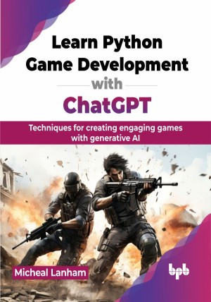

# Learn Python Game Development with ChatGPT

Leverage the power of AI in coding, graphics, design, and intelligence to join the next wave in game development

This is the repository for [Learn Python Game Development with ChatGPT
](https://bpbonline.com/products/learn-python-game-development-with-chatgpt),published by BPB Publications.

## About the Book
This book is a comprehensive guide to creating interactive and engaging games, leveraging the capabilities of ChatGPT and other advanced AI technologies. 

The book starts with prompt engineering and system prompting, building a strong AI foundation for game development. It covers various game genres, from text adventures to 3D shooters, showing AI integration. Each chapter is designed to build on the previous one, ensuring a cohesive learning experience that gradually increases in complexity and depth. Readers will learn game development basics and creative techniques for immersive game worlds. They will use PyZork for text games and Streamlit for enhanced visuals. The book covers AI-generated assets, behavior-driven AI, and advanced topics like isometric world-building and voice-responsive games. Practical projects help readers create their unique games, while GPT agents and AI technologies showcase the future of gaming.

By the end of this journey, readers will have a deep understanding of how to create innovative and engaging games using AI, positioning them at the forefront of modern game development.

## What You Will Learn
• Master prompt engineering for building games, game assets, and AI-driven games.

• Develop engaging text-based adventures with AI-driven storytelling elements.

• Create 2D games from platformers, isometric worlds, and physics.

• Design AI opponents with behavior-driven logic and adaptive difficulty.

• Introduction to 3D first-person shooters using GPT agents.

• Implement voice recognition and text-to-speech in interactive games.
